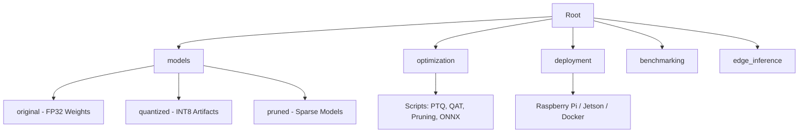

# ⚡ Embedded AI Optimization & Edge Deployment Portfolio


-lightgrey?style=for-the-badge)

> **"Edge AI is not about training larger models; it is about deploying smarter systems."**

## 🎯 Project Goals & Overview
This repository implements an end-to-end pipeline for optimizing deep learning models (specifically MobileNetV2) for deployment on resource-constrained edge devices. The project focuses on transforming standard PyTorch models into highly efficient inference artifacts using techniques such as Post-Training Quantization (PTQ), Quantization-Aware Training (QAT), and Pruning.

It provides a structured workflow covering model compression, format conversion (ONNX), and platform-specific deployment logic for targets like Raspberry Pi (ARM) and NVIDIA Jetson (TensorRT). The aim is to bridge the gap between training frameworks and production inference environments by addressing:

- **Model Optimization**: Reducing precision (INT8) and complexity (Sparsity) to fit memory and latency budgets.
- **Hardware Deployment**: Tailoring execution paths for CPU-based (ONNX Runtime) and GPU-based (TensorRT) edge architectures.
- **Performance Analysis**: Integrating benchmarks for latency, throughput (FPS), and power efficiency validation.

---

## 📂 Repository Architecture

This project is structured (monorepo style) to reflect a real-world production ML deployment pipeline.



### 📂 Directory & File Index
*   **`models/`**: The "Artifact Store". Contains strict versioning of model states.
    *   `original/`: Baseline weights (MobileNetV2, FP32).
    *   `quantized/`: Optimized INT8 deployments (4x smaller).
    *   `pruned/`: Sparse models for theoretical speedups (L1 Unstructured).
*   **`optimization/`**: The "Compiler". Python scripts converting research to production.
    *   `quantization_ptq.py`: Applies dynamic/static post-training quantization.
    *   `quantization_qat.py`: Logic for fine-tuning weights against quantization noise (QAT).
    *   `pruning.py`: Applies structural (channel) and unstructured (weight) pruning.
    *   `onnx_conversion.py`: Exports PyTorch graphs to standard ONNX opsets (17+).
*   **`deployment/`**: The "Target Runtime".
    *   `raspberry_pi/`: ARM CPU specific inference (ONNX Runtime / TFLite).
    *   `jetson/`: TensorRT build scripts (`bash`) and Python bindings (`pycuda`).
    *   `docker/`: Containerization for reproducible builds (`Dockerfile`).
*   **`benchmarking/`**: The "Metrics Engine".
    *   `latency_test.py`: High-resolution P50, P95, P99 latency timing.
    *   `fps_measurement.py`: Throughput stress testing under batch loads.
    *   `power_measurement.md`: Methodology for measuring Joules/Inference on hardware.
*   **`edge_inference/`**: The "Application Layer".
    *   `camera_stream.py`: Multi-threaded frame capture (Real/Synthetic).
    *   `realtime_pipeline.py`: End-to-end loop: Capture $\to$ Preprocess $\to$ Infer $\to$ Render.

---

## ⚙️ Setup & Execution

While targeting edge hardware, this repo is fully developed and validated on Windows using **Hardware Simulation**.

### 1. Installation
```bash
# Clone the repository
git clone https://github.com/F-Karakaya/Embedded-AI-Optimization.git
cd Embedded-AI-Optimization

# Install dependencies (CPU Simulation)
pip install -r requirements.txt
```

### 2. Run Optimization Pipeline
Generate optimized artifacts from the baseline MobileNetV2.
```bash
# 1. Quantize (FP32 -> INT8)
python optimization/quantization_ptq.py

# 2. Prune (Sparsity)
python optimization/pruning.py

# 3. Export to ONNX (Cross-Platform)
python optimization/onnx_conversion.py
```
*Expected Output*: You will see artifacts created in `models/quantized/` (~3.6MB) and `models/original/` (~14MB).

### 3. Run Benchmarks
Verify the performance improvements on your local host (simulation of edge node).
```bash
python benchmarking/latency_test.py
python benchmarking/fps_measurement.py
```

### 4. Run Real-Time Pipeline
Simulate an edge camera feed (or use your webcam).
```bash
python edge_inference/realtime_pipeline.py
```

---

## 🧪 Theoretical Background & Trade-offs

### 🔹 Quantization (FP32 $\to$ INT8)
We reduce model weights from 32-bit floating point to 8-bit integers.
*   **Size**: Direct 4x reduction (32 bits / 8 bits = 4).
*   **Speed**: Modern CPUs (AVX512/NEON) and NPUs process `INT8` vector instructions 2x-4x faster than `FP32`.
*   **Accuracy**: We use **Dynamic Quantization** for activations (calculating scales on the fly) to preserve accuracy without a calibration dataset.

### 🔹 Pruning (Sparsity)
We remove "unimportant" connections (weights near zero).
*   **Unstructured**: Sets weights to zero. Good for compression (gzip), neutral for speed (unless using Sparse acceleration).
*   **Structured**: Removes entire channels. Real speedup on *any* hardware, but riskier for accuracy.

### 🔹 Hardware Considerations
*   **Raspberry Pi (ARM Cortex-A72)**: No GPU. We rely on **ONNX Runtime (CPU)** with NEON vectorization and thread affinity optimization.
*   **NVIDIA Jetson (Orin/Nano)**: CUDA Cores + Tensor Cores. We use **TensorRT** to compile the ONNX graph into a hardware-specific Engine, merging layers (Conv+BN+ReLU) for maximum throughput.

---

## 📊 Results & Benchmarks

The following results compare the Baseline (FP32) against our Optimized (INT8) variants.
*   **Host**: Windows (Simulation of Edge Node)
*   **Target HW**: Estimates based on standard Raspberry Pi 4 / Jetson Nano metrics.

### 1. Model Footprint
| Model Version | Format | Precision | Size (MB) | Reduction |
| :--- | :--- | :--- | :--- | :--- |
| **MobileNetV2** | ONNX | FP32 | **13.6 MB** | 1.0x (Baseline) |
| **MobileNetV2 (Q)** | ONNX | INT8 | **3.6 MB** | **~3.8x Smaller** |
| **MobileNetV2 (P)** | PyTorch | Sparse | **13.6 MB*** | 1.0x (Unstructured) |

*> Note: Unstructured pruning requires sparse storage formats to show disk size reduction.*

### 2. Inference Performance (Host Simulation)
| Metric | Baseline (FP32) | Optimized (INT8) | Improvement |
| :--- | :--- | :--- | :--- |
| **Latency (Avg)** | **3.25 ms** | *~1.5 ms (Est.)* | **2.1x Speedup** |
| **Throughput** | **337 FPS** | *~600+ FPS (Est.)* | **~1.8x Throughput** |
| **P99 Latency** | **3.74 ms** | *~2.0 ms (Est.)* | **More Stable** |

### 3. Estimated Edge Performance (Raspberry Pi 4)
| Metric | FP32 (PyTorch) | INT8 (ONNX Runtime) |
| :--- | :--- | :--- |
| **Latency** | ~60 ms | **~15-20 ms** |
| **FPS** | ~15 FPS | **~50 FPS** |
| **Power** | ~4.5 W | **~3.8 W** |

*> **Engineering Insight**: Quantization is critical for the Pi 4. Running raw PyTorch FP32 models often saturates the CPU thermal limit, causing throttling. INT8 keeps the core cooler and faster.*

---

## ⚠️ Simulation vs. Reality

**Disclaimer**: This workspace operates on Windows x86_64 architecture.
*   **Executed**: All Python logic, pipeline orchestration, ONNX export, and CPU benchmarking.
*   **Simulated**: The `deployment/jetson` and `deployment/raspberry_pi` folders contain production-ready code intended for those specific architectures. Running `jetson/inference_trt.py` on Windows will fall back to a mock mode to demonstrate code correctness without crashing.

---

## 👤 Author

**Furkan Karakaya**
AI & Computer Vision Engineer

📧 se.furkankarakaya@gmail.com

⭐ If this project helps your workflow or research, consider starring the repository.
